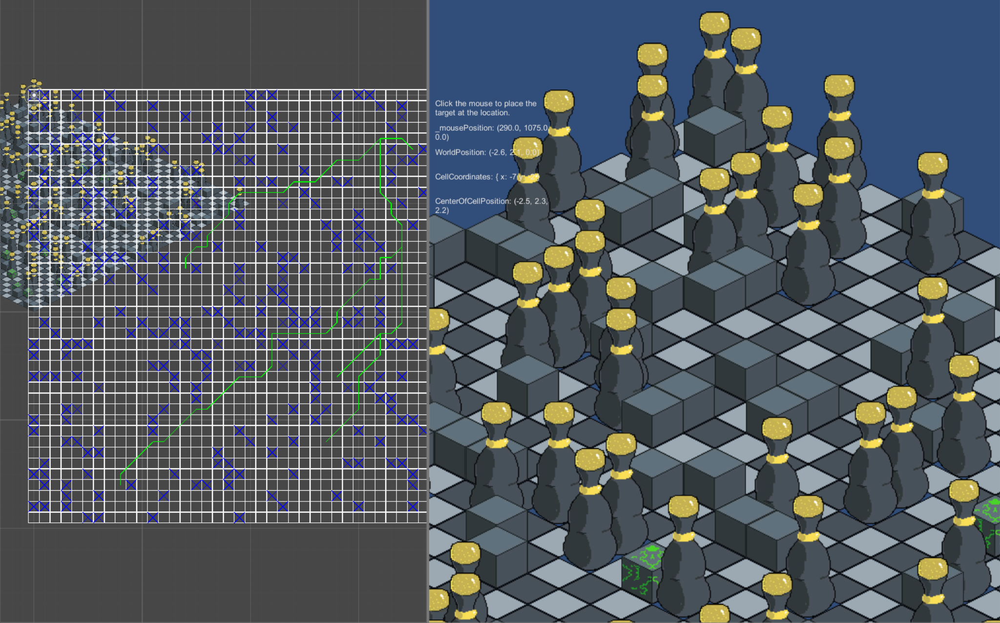

# Gridpath

Gridpath is a MIT licensed multithreaded 2D implementation of A* aimed at 2D games with just an X,Y axis in Unity3D. It is meant to be small, simple enough that you could modify yourself, and 2D centric.  It is reasonably fast and not a ton of code.  It also includes a visual debugger and an example scene containing most of the math needed to setup an isometric scene in Unity3D.

There is a working example in the project in the Example folder:

A couple of notes about the demo
- Set unity to 2D mode
- Click the mouse anywhere to place the target, the seeker cubes will move toward the target at all times, if you place it somewhere they cant reach, they will stop moving until you move the target to somewhere they can reach again, you cannot place the target off the grid.
- The coordinates of the grid in the demo and the grid correspond with the painters algorithm, in that the topmost square is 0,0, and the bottomRight most node is maxSizeX, maxSizeY.
- It is a bit slow because it is using native culling with sprite renderers for each tile, you'd be better of drawing them manually in your game and only drawing the stuff on the screen
- If you want to see the debug graph as shown in the picture enable it the inspector on the pathfinder component, it is also a bit of a resource hog.
- The seekerAI repaths incesssantly for load testing, if you wanted to improve perforamnce, just lower the repath rate.

# To use:

  - Add a Pathfinder component to an object in your scene
  - Access the pathfinder somewhere in the scene and configure the grid like so:

    Pathfinder.Instance.Init(20, 20, GridGraph.DiagonalOptions.DiagonalsWithoutCornerCutting, 4);
    
    
This will create a 20,20 grid with 4 threads, allowing diagonals, but not allowing the entities to cut corners.  For diagonals several options are supported, they are: 

- DiagonalsWithoutCornerCutting - diagonals allowed, cutting corners is not
- NoDiagonals - no diagonals allowed, only orthogonal movement will be attempted
- DiagonalsWithCornerCutting - diagonals and cutting corners is allowed.
    
You can now calculate paths like this:
    
        // Create this method or one like it on your MonoBehaviour
        public void OnPathComplete(Path p)
        {
            foreach (var error in p.Errors)
            {
                Debug.LogWarning("The path had the error: " + error);
            }

            if (p.Found)
            {
                Debug.Log("Received path!");
                _path = p;
                _pathIndex = 0;
            }
            else
            {
                Debug.LogWarning("No path to that exists...");
            }
        }

Now call the pathfinder,  (Start, or update or wherever)
    
    PathFinder.Instance.StartPath(_myPosition.X, _myPosition.Y, _targetPosition.X, _targetPosition.Y, OnPathComplete);
    
Your method will be executed in the main unity thread whenever the path calculation is complete.

You can now iterate the path, and move your object to the path nodes as usual:
First we'll declare a Move coroutine:

        IEnumerator Move()
        {
            while (true)
            {
                if (_path != null && _pathIndex < _path.Nodes.Count)
                {
                    var nextNode = _path.Nodes[_pathIndex];
                    _myPosition.X = nextNode.X;
                    _myPosition.Y = nextNode.Y;
                    _pathIndex++;
                }
                yield return new WaitForSeconds(1f);
            }
        }
        
Then we will Activate that in the start method of our MonoBehaviour

        void Start()
        {
            StartCoroutine(Move());
        }

### Mark tiles as walkable/not walkable
Set tile at 0,0 to false:

    Pathfinder.Instance.Grid.SetWalkable(0,0,false) 

### Add weight to a tile
Set weight on the tile at 0,0 to 50:
    
    Pathfinder.Instance.Grid.SetWeight(0,0,50); 

### Decoupled use
If you want, you can use the pathfinder in your own threads, or with your own manager by simply creating the grid yoursef, and passing it to a pathsolver.  This wont be multithreaded(unless you do it yourself), and you wont get the debugger etc, but it might be desirable in some cases, this is all that is required:

    GridGraph graph = new GridGraph(20,20,GridGraph.DiagonalSetting.DiagonalsWithoutCornerCutting);
    graph.SetWalkable(1,0,false);
    graph.SetWalkable(1,2,false); 
    graph.SetWalkable(1,3,false); 
    PathSolver solver = new PathSolver();
    solver.FindPath(startX, startY, endX, endY, graph);

### Note on the implementation

Astute readers may not that the basic API calls bear some semblance to 
[Aran Granberg's A* implementation](https://arongranberg.com/astar/) this is because I wrote this project as a 2D replacment for for my game as I needed something a bit more 2D friendly, so a few of the API methods bear a bit of a semblance. Though they're quite a bit shorter and simpler under the hood. If you need a more complete solution out of the box or a 3D implmentation, you might consider checking out his project.
    
### Special Thanks

[Clint Bellanger's artice on isometic math](http://clintbellanger.net/articles/isometric_math)

[Patrick Lester article on A* pathfinding](http://www.policyalmanac.org/games/aStarTutorial.htm)

[Amit Pattel's reference on A*](http://www-cs-students.stanford.edu/~amitp/gameprog.html#Paths)

[BlueRaja Concurrent min-Priority Queue implementation](https://github.com/BlueRaja/High-Speed-Priority-Queue-for-C-Sharp)

### License
    
[MIT license](LICENSE.md)

### Contact

email: 
corymichaellee at gmail.com

[Twitter](https://twitter.com/coryleeio)

[My blog](http://corylee.io)

[Github](https://github.com/coryleeio)

